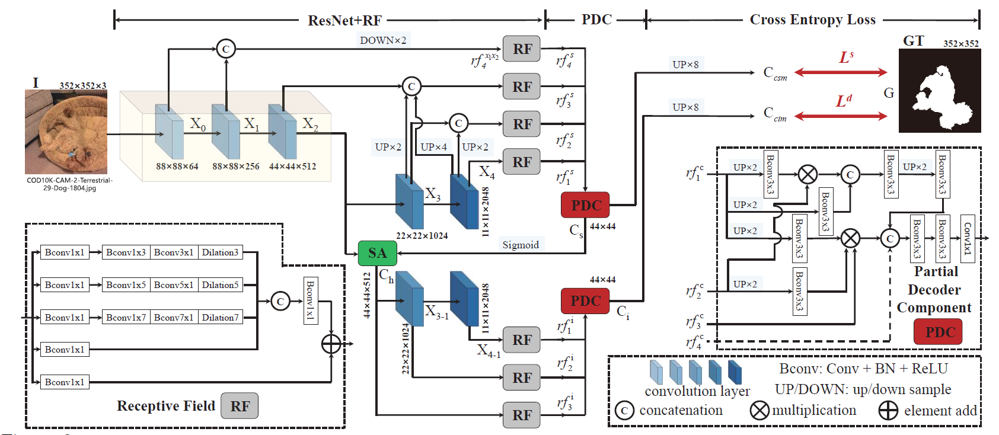
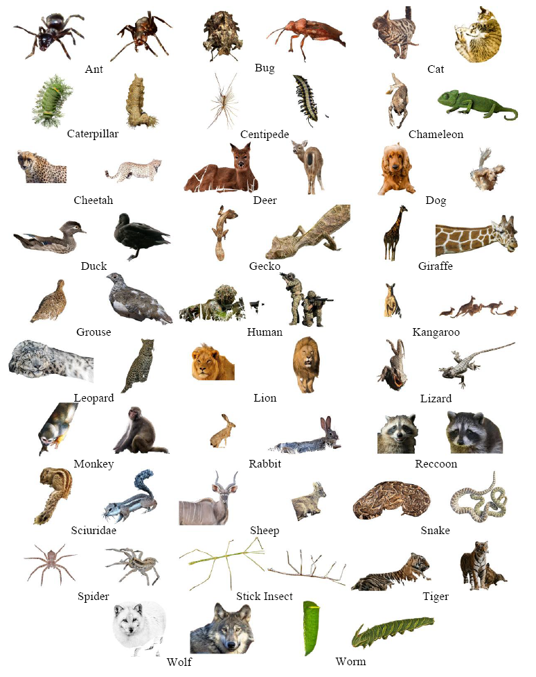
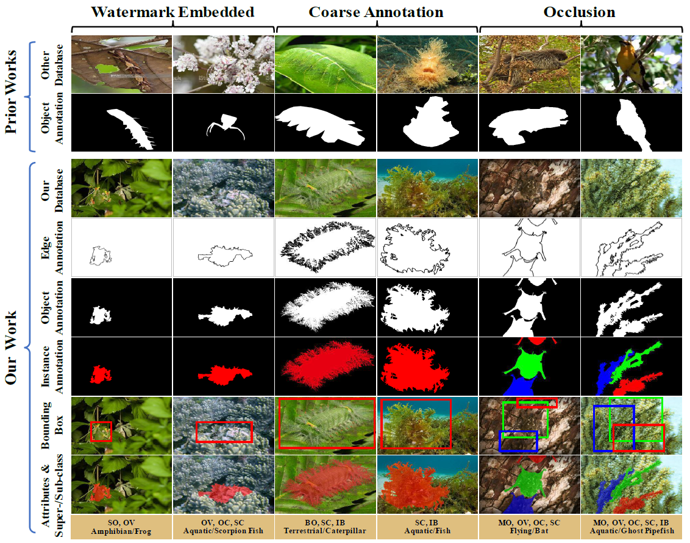
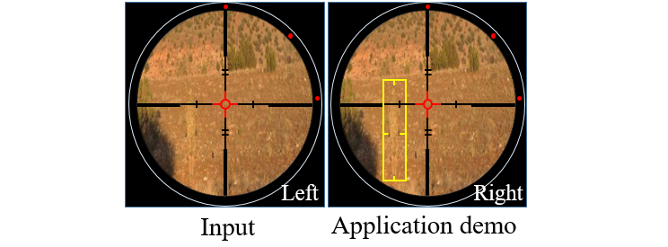
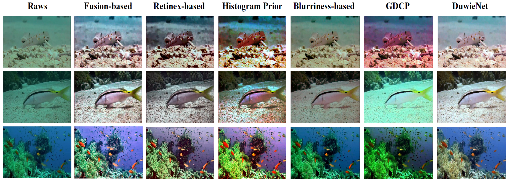

# Camouflaged Object Detection (Accepted by Oral Presentation in CVPR, 2020)

This repository includes detailed introduction, strong baseline 
(Search & Identification Net, **SINet**), and one-key evaluation codes for a brand new filed named 
Camouflaged Object Detection (COD).

> Train/Test code will be updated soon ...

## 1. Task Relationship

Figure 1: Task relationship. One of the most popular directions in computer vision is generic object detection. 
Note that generic objects can be either salient or camouflaged; camouflaged objects can be seen as difficult cases of 
generic objects. Typical generic object detection tasks include semantic segmentation and panoptic 
segmentation (see Fig. 2 b).

Figure 2: Given an input image (a), we present the ground-truth for (b) panoptic segmentation 
(which detects generic objects including stuff and things), (c) salient instance/object detection 
(which detects objects that grasp human attention), and (d) the proposed camouflaged object detection task, 
where the goal is to detect objects that have a similar pattern (e.g., edge, texture, or color) to the natural habitat. 
In this case, the boundaries of the two butterflies are blended with the bananas, making them difficult to identify. 
This task is far more challenging than the traditional salient object detection or generic object detection.

> References of Salient Object Detection (SOD) benchmark works 
> [1] Video SOD: Shifting More Attention to Video Salient Object Detection. CVPR, 2019. ([Project Page](http://dpfan.net/davsod/)) 
> [2] RGB SOD: Salient Objects in Clutter: Bringing Salient Object Detection to the Foreground. ECCV, 2018. ([Project Page](https://dpfan.net/socbenchmark/)) 
> [3] RGB-D SOD: Rethinking RGB-D Salient Object Detection: Models, Datasets, and Large-Scale Benchmarks. TNNLS, 2020. ([Project Page](http://dpfan.net/d3netbenchmark/)) 
> [4] Co-SOD: Taking a Deeper Look at the Co-salient Object Detection. CVPR, 2020. ([Project Page](http://dpfan.net/CoSOD3K/))

## 2. Proposed Baseline

### 2.1. Overview

> To be continued, please star our project for the updating infos.

Figure 3: Overview of our SINet framework, which consists of two main components: the receptive field (RF) 
and partial decoder component (PDC). The RF is introduced to mimic the structure of RFs in the human visual system. 
The PDC reproduces the search and identification stages of animal predation. 
SA = search attention function described in [71]. See x 4 for details.

### 2.2. Usage

The training and testing experiments are conducted using [PyTorch](https://github.com/pytorch/pytorch) with 
a single GeForce RTX TITAN GPU of 24GB Memory. (Note that our model also supports low memory GPU (~xx MB per image))

1. Configuring your environment (Prerequisites):
    
    Note that we only test on the aforementioned versions, and thus, any other version may be error!)
    
    + creating a virtual environment: `conda create -n SINet python=3.6`
    
    + installing necessary packages: `pip install -r requirements.txt`

2. Downloading Training and Testing Sets:

    + download training dataset and move it into `.\your\path`, 
    which can be found in this [download link](https://drive.google.com/open?id=1aH9_0w3zCVoh9ttrU10xjCYcjuvPuzWY).

    + downloading testing dataset and move it into `.\your\path`, 
    which can be found in this [download link](https://drive.google.com/open?id=1AeJBD-FemHSVdprC8_6BOi41Wt5KgMIt).

3. Training Configuration:

    + changing your train img/gt directory in the `parser` of `MyTrain.py`: `--train_img_dir` for training image (_\*.jpg_) and 
    `train_gt_dir` for training ground truth (_\*.png_) and the trained model will be saved per `--save_epoch` epochs in the `--save_model`
    directory.

3. Testing Configuration:

    change your test img/gt directory in the `parser` of `MyTest.py`:
    replace your trained model directory (`--model_path`) and assign your the 
    save dir of inferred mask (`--test_save`)

4. Evaluation your trained model:

    One-key evaluation is written in MATLAB code (revised from [link]()), please follow this [instructions]().

## Results

Figure 4: Qualitative results of our SINet and two top-performing baselines on COD10K. Refer to our paper for details.

Table 1: Quantitative results on different datasets. The best scores are highlighted in bold. See Section 5.1 for 
training details: (i) CPD1K, (ii) CAMO, (iii) COD10K, (iv) CPD1K + CAMO + COD10K. 
Note that the ANet-SRM model (only trained on CAMO) does not have a publicly available code, thus other results 
are not available. $E_\phi$ denotes mean Emeasure. Baseline models are trained using the training setting (iv). 

Table 2: Quantitative results of Structure-measure (Sα) for each sub-class in our COD10K dataset-(1/2). The best
score of each category is highlighted in bold.  

Table 3: Quantitative results of Structure-measure (Sα) for each sub-class in our COD10K dataset-(2/2). The best
score of each category is highlighted in bold.  

#### Results Download 

1. Results of our SINet on four datasets (e.g., CHAMELEON[1], CPD1K-Test[2], CAMO-Test[3], and COD10K-Test[4]) 
can be found in this [download link](https://drive.google.com/open?id=1fHAwcUwCjBKSw8eJ9OaQ9_0kW6VtDZ6L).

2. Performance of competing methods can be found in this [download link](https://drive.google.com/open?id=1jGE_6IzjGw1ExqxteJ0KZSkM4GaEVC4J).

> References of datasets 
[1] Animal camouflage analysis: Chameleon database. Unpublished Manuscript, 2018.  
[2] Detection of people with camouflage pattern via dense deconvolution network. IEEE SPL, 2018. 
[3] Anabranch network for camouflaged object segmentation. CVIU, 2019. 
[4] Camouflaged Object Detection, CVPR, 2020.

## Proposed COD10K Datasets

Figure 5: The extraction of individual samples including 29 sub-classes from our COD10K (1/5)–Terrestrial animals. 

Figure 6: Annotation diversity and meticulousness in the proposed COD10K dataset. Instead of only providing coarse-grained
 object-level annotations with the three major types of bias (e.g., Watermark embedded, Coarse annotation, and Occlusion) 
 in prior works, we offer six different annotations, which include edge-level (4rd row), object-level (5rd row), 
 instance-level (6rd row), bounding boxes (7rd row), and attributes (8rd row). Refer to the manuscript for more attribute 
 details. 

Figure 7: Regularized quality control during our labeling reverification stage. Strictly adheres to the 
four major criteria of rejection or acceptance to near the ceiling of annotation accuracy. 

COD10K datasets: coming soon.

## Potential Applications

1. Medical (Polyp Segmentation)

    Lung Infection Segmentation
  

   
    Example of COVID-19 infected regions in CT axial slice, where the red and green regions denote the GGO, and consolidation, respectively. The images are collected from [1]. 
[1] COVID-19 CT segmentation dataset, link: https://medicalsegmentation.com/covid19/, accessed: 2020-04-11.

2. Agriculture (locust detection to prevent invasion) 

3. Art (e.g., for photorealistic blending, or recreational art) 
Camouflaging an Object from Many Viewpoints 

The answer can be found at here (Camouflaging an Object from Many Viewpoints, CVPR 2014.). 

4. Military (for discriminating enemies)

5. Computer Vision (e.g., for search-and-rescue work, or rare species discovery)

6. Underwater Image Enhancement 

Please refer to "An Underwater Image Enhancement Benchmark Dataset and Beyond, TIP2019" for more details.  

## User Study Test

http://dpfan.net/wp-content/uploads/UserStudy-V1.1-8test.pptx

## Paper

http://dpfan.net/wp-content/uploads/2020CVPROralSINetCamouflaged-Object-Detection.pdf

## Citation
Please cite our paper if you find the work useful: 

	@inproceedings{fan2020Camouflage,
  	title={Camouflaged Object Detection},
  	author={Fan, Deng-Ping and Ji, Ge-Peng and Sun, Guolei and Cheng, Ming-Ming and Shen, Jianbing and Shao, Ling},
  	booktitle={IEEE Conference on Computer Vision and Pattern Recognition (CVPR)},
  	year={2020}
	}
  
