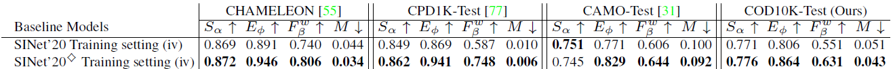
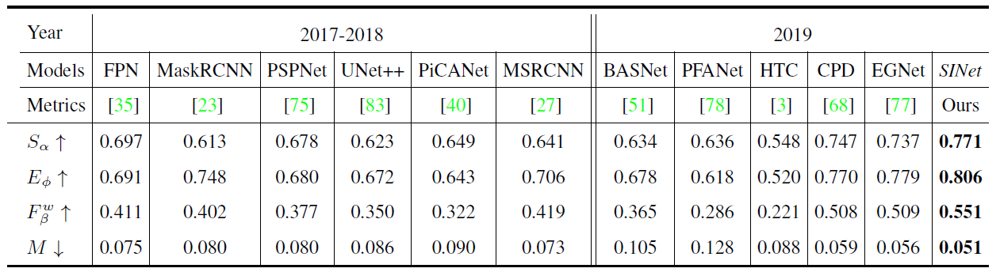
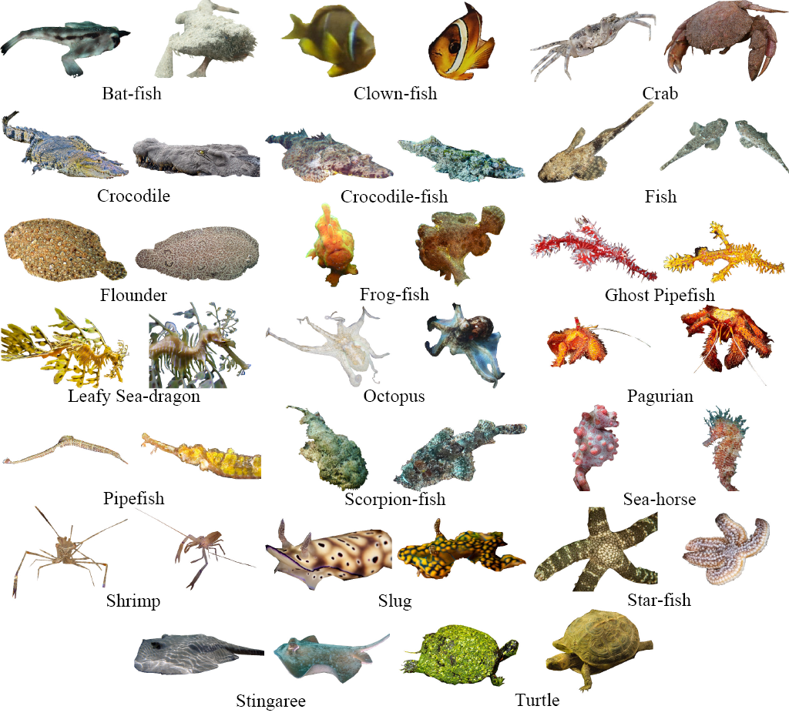
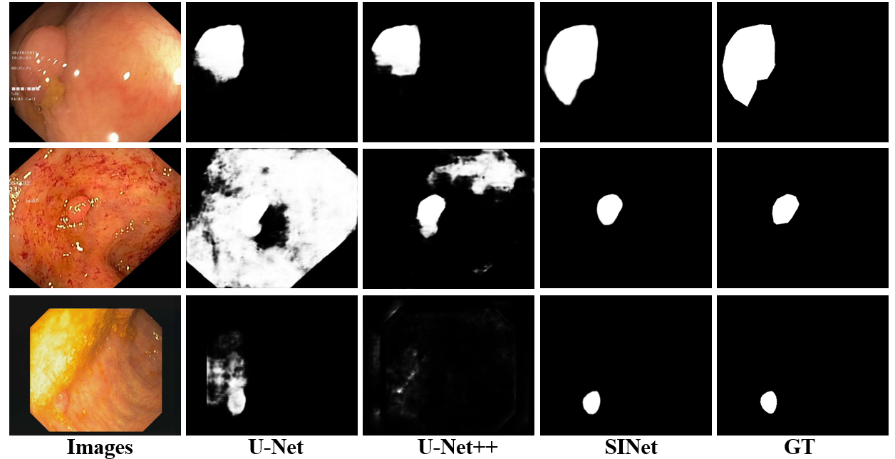

# Camouflaged Object Detection (CVPR2020)

> Authors:
> [Deng-Ping Fan](https://dpfan.net/), 
> [Ge-Peng Ji](https://scholar.google.com/citations?user=oaxKYKUAAAAJ&hl=en), 
> [Guolei Sun](https://github.com/GuoleiSun), 
> [Ming-Ming Cheng](https://mmcheng.net/), 
> [Jianbing Shen](http://iitlab.bit.edu.cn/mcislab/~shenjianbing), 
> [Ling Shao](http://www.inceptioniai.org/).

## 0. Preface

- This repository includes detailed introduction, strong baseline 
(Search & Identification Net, SINet), and one-key evaluation codes for a brand new field named **_Camouflaged Object Detection (COD)_**.

- For more information about Camouflaged Object Detection, please visit our [Project Page](http://dpfan.net/Camouflage/) 
and read the [Manuscript (PDF)](http://dpfan.net/wp-content/uploads/CVPR20_Oral_CamouflagedObjDet.pdf) / [ChineseVersion (PDF)](http://dpfan.net/wp-content/uploads/CamouflagedObjectDetection_Chinese.pdf).

- If you have any questions about our paper, feel free to contact [Deng-Ping Fan](dengpfan@gmail.com) 
or [Ge-Peng Ji](gepengai.ji@gmail.com) via E-mail. And if you are using SINet or evaluation toolbox for your research, 
please cite this paper ([BibTeX](http://dpfan.net/wp-content/uploads/Camouflage.txt)) 

### 0.1. Table of Contents

- [Camouflaged Object Detection (Accepted by Oral Presentation in CVPR, 2020)](#camouflaged-object-detection--accepted-by-oral-presentation-in-cvpr--2020-)
  * [0. Preface](#0-preface)
    + [0.1. Table of Contents](#01-table-of-contents)
    + [0.2. NEWS](#02-news)
  * [1. Task Relationship](#1-task-relationship)
  * [2. Proposed Baseline](#2-proposed-baseline)
    + [2.1. Overview](#21-overview)
    + [2.2. Usage](#22-usage)
  * [3. Results](#3-results)
    + [3.1. Qualitative Comparison](#31-qualitative-comparison)
    + [3.2. Quantitative Comparison (Overall/Sub-class)](#32-quantitative-comparison--overall-sub-class-)
    + [3.3. Results Download](#33-results-download)
  * [4. Proposed COD10K Datasets](#4-proposed-cod10k-datasets)
  * [5. Evaluation Toolbox](#5-evaluation-toolbox)
  * [6. Potential Applications](#6-potential-applications)
  * [7. User Study Test](#7-user-study-test)
  * [8. Citation](#8-citation)
  * [9. LICENSE](#9-license)
  * [10. Acknowledgements](#10-acknowledgements)
  * [11. TODO LIST](#11-todo-list)
  * [12. FAQ](#12-faq)

### 0.2. NEWS

- [2020/05/05] Release testing code.
- [2020/04/25] Training/Testing code will be updated soon ...

## 1. Task Relationship

      
    <em> 
    Figure 1: Task relationship. One of the most popular directions in computer vision is generic object detection. 
    Note that generic objects can be either salient or camouflaged; camouflaged objects can be seen as difficult cases of 
    generic objects. Typical generic object detection tasks include semantic segmentation and panoptic 
    segmentation (see Fig. 2 b).
    </em>

      
    <em> 
    Figure 2: Given an input image (a), we present the ground-truth for (b) panoptic segmentation 
    (which detects generic objects including stuff and things), (c) salient instance/object detection 
    (which detects objects that grasp human attention), and (d) the proposed camouflaged object detection task, 
    where the goal is to detect objects that have a similar pattern (e.g., edge, texture, or color) to the natural habitat. 
    In this case, the boundaries of the two butterflies are blended with the bananas, making them difficult to identify. 
    This task is far more challenging than the traditional salient object detection or generic object detection.
    </em>

> References of Salient Object Detection (SOD) benchmark works 
> [1] Video SOD: Shifting More Attention to Video Salient Object Detection. CVPR, 2019. ([Project Page](http://dpfan.net/davsod/)) 
> [2] RGB SOD: Salient Objects in Clutter: Bringing Salient Object Detection to the Foreground. ECCV, 2018. ([Project Page](https://dpfan.net/socbenchmark/)) 
> [3] RGB-D SOD: Rethinking RGB-D Salient Object Detection: Models, Datasets, and Large-Scale Benchmarks. TNNLS, 2020. ([Project Page](http://dpfan.net/d3netbenchmark/)) 
> [4] Co-SOD: Taking a Deeper Look at the Co-salient Object Detection. CVPR, 2020. ([Project Page](http://dpfan.net/CoSOD3K/))

## 2. Proposed Baseline

### 2.1. Overview

      
    <em> 
    Figure 3: Overview of our SINet framework, which consists of two main components: the receptive field (RF) 
    and partial decoder component (PDC). The RF is introduced to mimic the structure of RFs in the human visual system. 
    The PDC reproduces the search and identification stages of animal predation. 
    SA = search attention function described in [71]. See x 4 for details.
    </em>

### 2.2. Usage

The training and testing experiments are conducted using [PyTorch](https://github.com/pytorch/pytorch) with 
a single GeForce RTX TITAN GPU of 24 GB Memory.

> Note that our model also supports low memory GPU, which means you can lower the batch size
(~419 MB per image in `apex-mode=O1`, and ~305 MB per image in `apex-mode=O2`)

1. Configuring your environment (Prerequisites):
   
    Note that SINet is only tested on Ubuntu OS with the following environments. 
    It may work on other operating systems as well but we do not guarantee that it will.
    
    + Creating a virtual environment in terminal: `conda create -n SINet python=3.6`.
    
    + Installing necessary packages: `pip install -r requirements.txt`.
    
    + (Optional: only for training) Installing [NVIDIA-Apex](https://github.com/NVIDIA/apex) 
    for accelerate training process with mixed precision. 
    [(Instructions)](https://github.com/NVIDIA/apex#linux) (Under CUDA-10.0 and Cudnn-7.4).

2. Downloading Training and Testing Sets:

    + download training dataset and move it into `./Dataset/TrainDataset/`, 
    which can be found in this [download link](https://drive.google.com/open?id=1qNI4U8bY4bmRI4dqzU-6QqZDWBmgFXin).

    + downloading testing dataset and move it into `./Dataset/TestDataset/`, 
    which can be found in this [download link](https://drive.google.com/open?id=10r-yR-SU8UfW8c6WuNXj1hg752JtTp4L).

3. Training Configuration:

    Coming soon ...

3. Testing Configuration:

    + After you download all the pre-trained model and testing data, just run `MyTest.py` to generate the final prediction map: 
    replace your trained model directory (`--model_path`) and assign your the save directory of inferred mask (`--test_save`)
    
    + Note that we re-trained our model (marked as $\diamondsuit$ in the following figure) equipped with mixed training 
    strategy of Apex lib (`mode=O1`) and get better performance in 40 epoch. Here we provide a new pre-trained model 
    ([Baidu Drive]()/[Google Drive](https://drive.google.com/open?id=1iCkHXU55Or4gEtSqesijea6A5r8lVEYv)) here. Later, We will try different backbones based SINet to improve performance 
    and provide more comprehensive comparison.  

    

          
    

4. Evaluation your trained model:

    + One-key evaluation is written in MATLAB code (revised from [link](https://github.com/DengPingFan/CODToolbox)), 
    please follow this the instructions in `main.m` and just run it to generate the evaluation results in 
    `./EvaluationTool/EvaluationResults/Result-CamObjDet/`.

## 3. Results

### 3.1. Qualitative Comparison

      
    <em> 
    Figure 4: Qualitative results of our SINet and two top-performing baselines on COD10K. Refer to our paper for details.
    </em>

### 3.2. Quantitative Comparison (Overall/Sub-class)

      
    <em> 
    Table 1: Quantitative results on different datasets. The best scores are highlighted in bold. See Section 5.1 for 
    training details: (i) CPD1K, (ii) CAMO, (iii) COD10K, (iv) CPD1K + CAMO + COD10K. 
    Note that the ANet-SRM model (only trained on CAMO) does not have a publicly available code, thus other results 
    are not available. $E_\phi$ denotes mean Emeasure. Baseline models are trained using the training setting (iv).
    </em>

      
    <em> 
    Table 2: Quantitative results of Structure-measure (Sα) for each sub-class in our COD10K dataset-(1/2). The best
    score of each category is highlighted in bold.
    </em>

      
    <em> 
    Table 3: Quantitative results of Structure-measure (Sα) for each sub-class in our COD10K dataset-(2/2). The best
    score of each category is highlighted in bold.
    </em>

### 3.3. Results Download 

1. Results of our SINet on four datasets (e.g., CHAMELEON[1], CPD1K-Test[2], CAMO-Test[3], and COD10K-Test[4]) 
can be found in this [download link](https://drive.google.com/open?id=1fHAwcUwCjBKSw8eJ9OaQ9_0kW6VtDZ6L).

2. Performance of competing methods can be found in this [download link](https://drive.google.com/open?id=1jGE_6IzjGw1ExqxteJ0KZSkM4GaEVC4J).

> References of datasets 
[1] Animal camouflage analysis: Chameleon database. Unpublished Manuscript, 2018.  
[2] Detection of people with camouflage pattern via dense deconvolution network. IEEE SPL, 2018. 
[3] Anabranch network for camouflaged object segmentation. CVIU, 2019. 
[4] Camouflaged Object Detection, CVPR, 2020.

## 4. Proposed COD10K Datasets

      
    <em> 
    Figure 5: The extraction of individual samples including 20 sub-classes from our COD10K (2/5)–Aquatic animals.
    </em>

      
    <em> 
    Figure 6: Annotation diversity and meticulousness in the proposed COD10K dataset. Instead of only providing coarse-grained
    object-level annotations with the three major types of bias (e.g., Watermark embedded, Coarse annotation, and Occlusion) 
    in prior works, we offer six different annotations, which include edge-level (4rd row), object-level (5rd row), 
    instance-level (6rd row), bounding boxes (7rd row), and attributes (8rd row). Refer to the manuscript for more attribute 
    details.
    </em>

      
    <em> 
    Figure 7: Regularized quality control during our labeling reverification stage. Strictly adheres to the 
    four major criteria of rejection or acceptance to near the ceiling of annotation accuracy.
    </em>

> COD10K datasets: coming soon.

## 5. Evaluation Toolbox

We provide complete and fair one-key evaluation toolbox for benchmarking within a uniform standard. 
Please refer to this link for more information: https://github.com/DengPingFan/CODToolbox

## 6. Potential Applications

1. Medical (Polyp Segmentation and COVID-19 Infection Segmentation Diagnose)

      
    <em> 
    Figure 8: Lung Infection Segmentation.
    </em>

​    

      
    <em> 
    Figure 9: Example of COVID-19 infected regions in CT axial slice, where the red and green regions denote the GGO, 
    and consolidation, respectively. The images are collected from here. 
    (COVID-19 CT segmentation dataset (link: https://medicalsegmentation.com/covid19/, accessed: 2020-04-11).)
    </em>

2. Agriculture (locust detection to prevent invasion)

      
    <em> 
    Figure 10: Locust disaster detection.
    </em>

3. Art (e.g., for photorealistic blending, or recreational art)

      
    <em> 
    Figure 11: The answer can be found at here (Camouflaging an Object from Many Viewpoints, CVPR 2014.)
    </em>

4. Computer Vision (e.g., for search-and-rescue work, or rare species discovery)

      
    <em> 
    Figure 13: Search and Rescue for saving lives.
    </em>

5. Underwater Image Enhancement

      
    <em> 
    Figure 14: Please refer to "An Underwater Image Enhancement Benchmark Dataset and Beyond, TIP2019" for more details.
    </em>

## 7. User Study Test

[--> Click here to explore more interest things (YouTube Link) <--](https://youtu.be/Ovv_leSGKDw)

## 8. Citation

Please cite our paper if you find the work useful: 

	@inproceedings{fan2020Camouflage,
  	title={Camouflaged Object Detection},
  	author={Fan, Deng-Ping and Ji, Ge-Peng and Sun, Guolei and Cheng, Ming-Ming and Shen, Jianbing and Shao, Ling},
  	booktitle={IEEE Conference on Computer Vision and Pattern Recognition (CVPR)},
  	year={2020}
	}

## 9. LICENSE

- The COD10K Dataset is made available for non-commercial purposes only.

- You will not, directly or indirectly, reproduce, use, or convey the COD10K Dataset 
or any Content, or any work product or data derived therefrom, for commercial purposes.

## 10. Acknowledgements

We would like to thank authors of CHAMELEON, CPD1K, and CAMO dataset for their work. 
They provide tremendous efforts in these dataset to boost this field. 
We also appreciate image annotators and 
[Wenguan Wang](https://scholar.google.com/citations?user=lZQRrrkAAAAJ&hl=zh-CN), 
[Geng Chen](https://www.researchgate.net/profile/Geng_Chen13), 
[Hongsong Wang](https://scholar.google.com/citations?hl=zh-CN&user=LzQnGacAAAAJ) for insightful feedback and discussion.

## 11. TODO LIST

> If you want to improve the usability or any advices, please feel free to contact me directly ([E-mail](gepengai.ji@gmail.com)).

- [ ] Support `NVIDIA APEX` training.

- [ ] Support different backbones (
VGGNet, 
ResNet, 
[ResNeXt](https://github.com/facebookresearch/ResNeXt)
[Res2Net](https://github.com/Res2Net/Res2Net-PretrainedModels), 
[iResNet](https://github.com/iduta/iresnet), 
and 
[ResNeSt](https://github.com/zhanghang1989/ResNeSt) 
etc.)

- [ ] Support distributed training.

- [ ] Support lightweight architecture and real-time inference, like MobileNet, SqueezeNet.

- [ ] Support distributed training

- [ ] Add more comprehensive competitors.

## 12. FAQ

1. If the image cannot be loaded in the page (mostly in the domestic network situations).

    [Solution Link](https://blog.csdn.net/weixin_42128813/article/details/102915578)

---

**[⬆ back to top](#0-preface)**
